# 校园论坛项目 - 功能流程图设计

## 一、设计原则

### 1.1 设计理念
- **模块化设计**：功能独立，低耦合高内聚
- **可扩展架构**：预留接口，方便后续添加功能
- **版本管理**：清晰的功能版本划分
- **现代技术**：采用微服务思想，前后端分离
- **高效合理**：优化流程，减少冗余

### 1.2 架构特点
- ✅ 前后端分离
- ✅ RESTful API设计
- ✅ 模块化功能设计
- ✅ 插件化扩展机制
- ✅ 版本化迭代

---

## 二、系统整体架构图

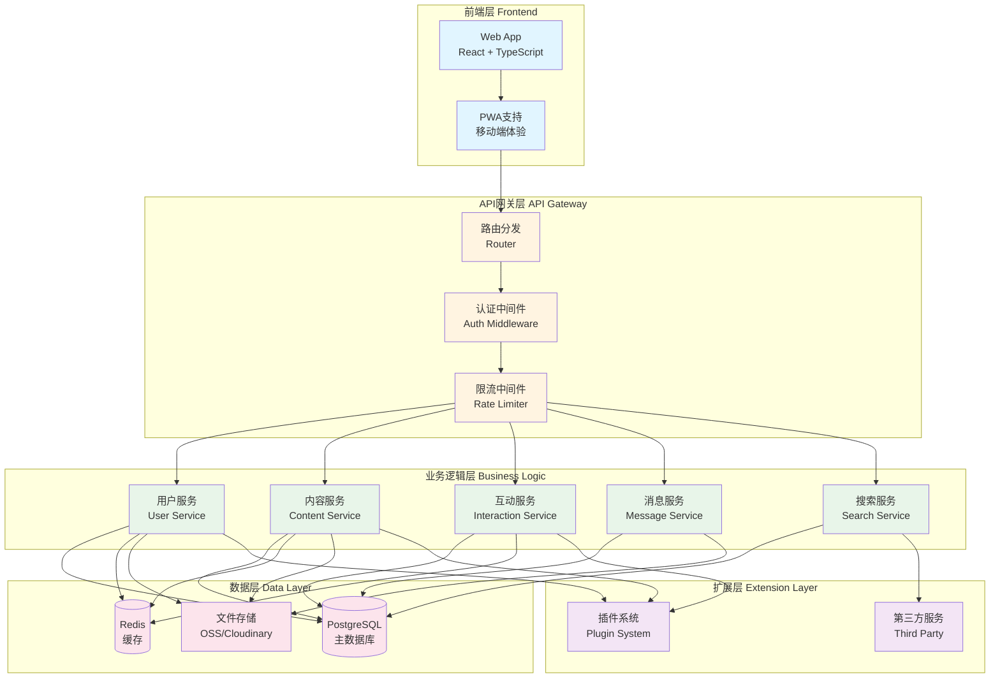

---

## 三、功能模块架构图

```mermaid
graph LR
    subgraph "核心模块 Core Modules"
        A1[用户模块<br/>User Module]
        A2[内容模块<br/>Content Module]
        A3[分类模块<br/>Category Module]
    end
    
    subgraph "功能模块 Feature Modules"
        B1[搜索模块<br/>Search Module]
        B2[互动模块<br/>Interaction Module]
        B3[资料模块<br/>Resource Module]
        B4[关注模块<br/>Follow Module]
        B5[私信模块<br/>Message Module]
    end
    
    subgraph "扩展模块 Extension Modules"
        C1[活动模块<br/>Event Module<br/>v2.0]
        C2[评价模块<br/>Review Module<br/>v3.0]
    end
    
    A1 --> B1
    A1 --> B2
    A1 --> B4
    A1 --> B5
    A2 --> B1
    A2 --> B2
    A2 --> B3
    A3 --> B1
    
    Note: 交易信息通过"交易"分类发帖实现<br/>交易在第三方平台完成
    
    A2 -.扩展.-> C1
    A2 -.扩展.-> C2
    
    style A1 fill:#4caf50
    style A2 fill:#4caf50
    style A3 fill:#4caf50
    style B1 fill:#2196f3
    style B2 fill:#2196f3
    style B3 fill:#2196f3
    style B4 fill:#2196f3
    style B5 fill:#2196f3
    style C1 fill:#ff9800
    style C2 fill:#ff9800
    style C3 fill:#ff9800
```

---

## 四、核心功能流程图

### 4.1 用户注册/登录流程

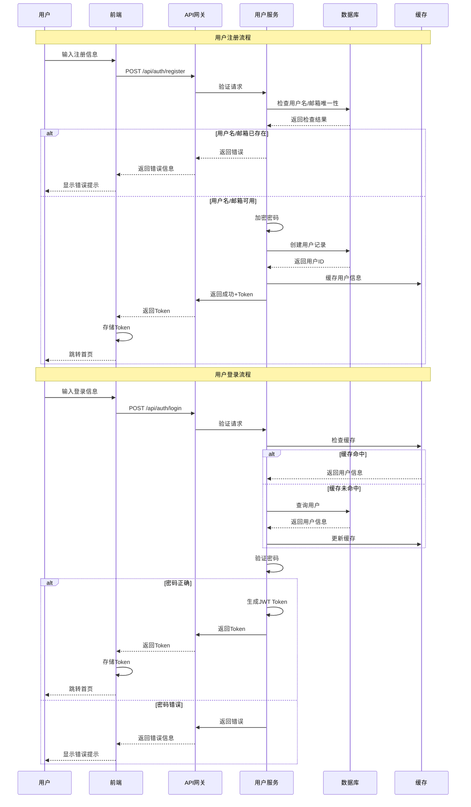

---

### 4.2 发帖流程

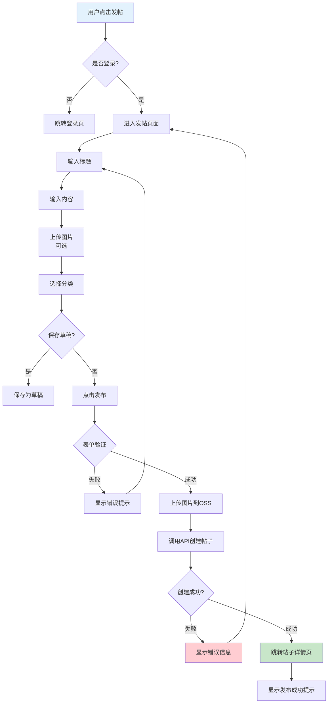

---

### 4.3 帖子浏览流程

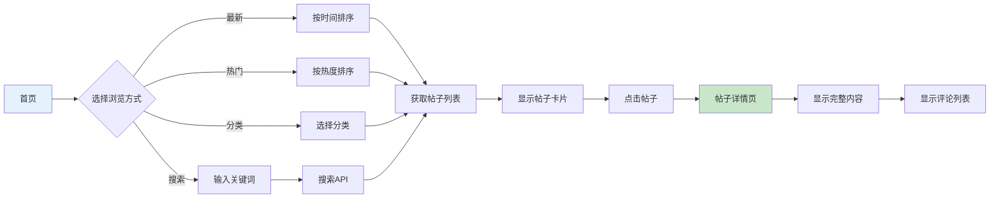

---

### 4.4 评论/回复流程

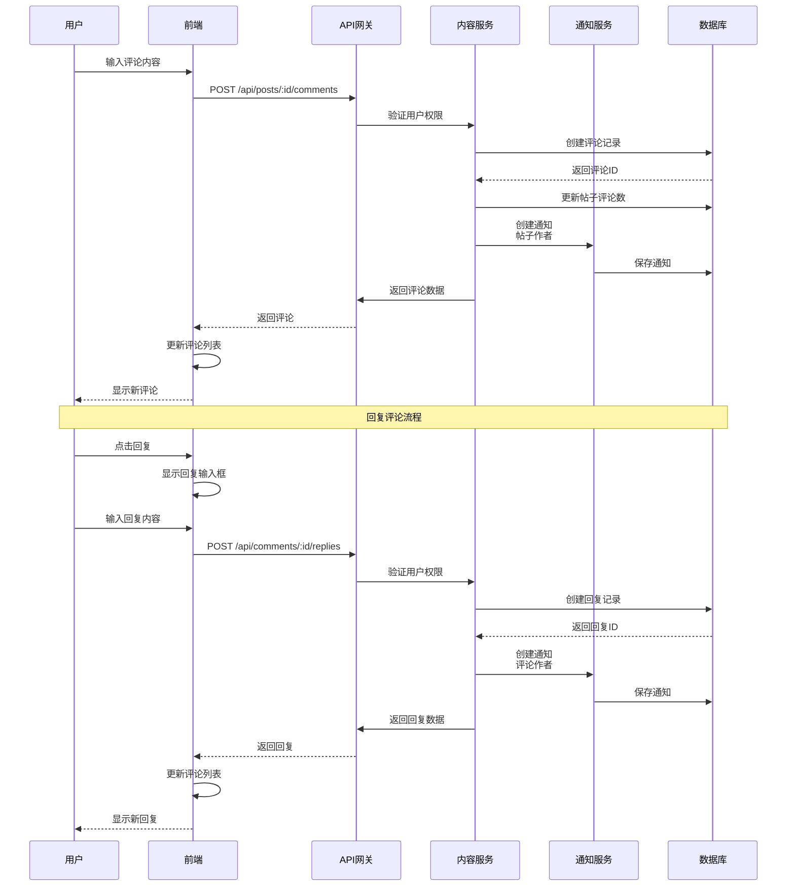

---

### 4.5 点赞/收藏流程

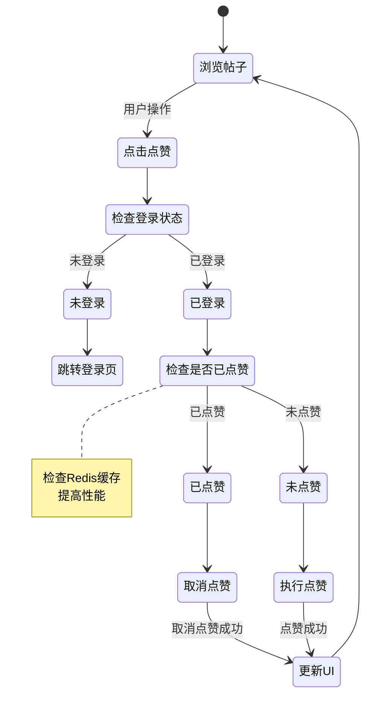

---

### 4.6 搜索流程

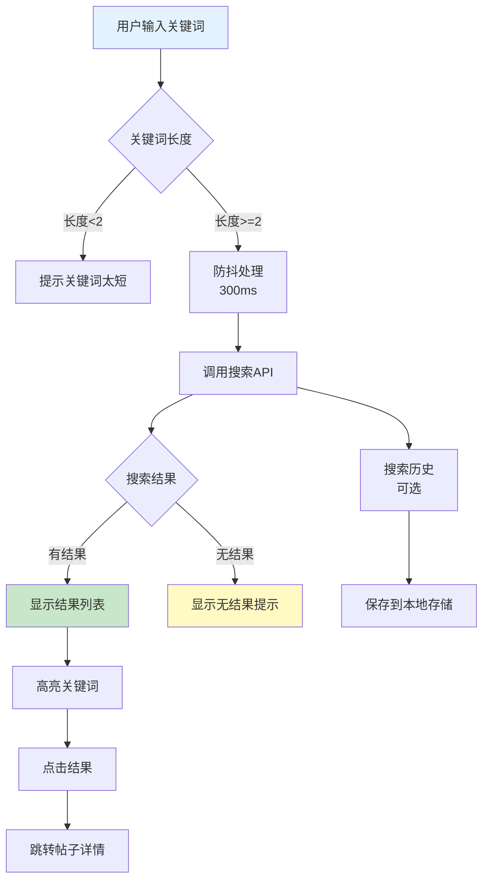

---

### 4.7 私信流程

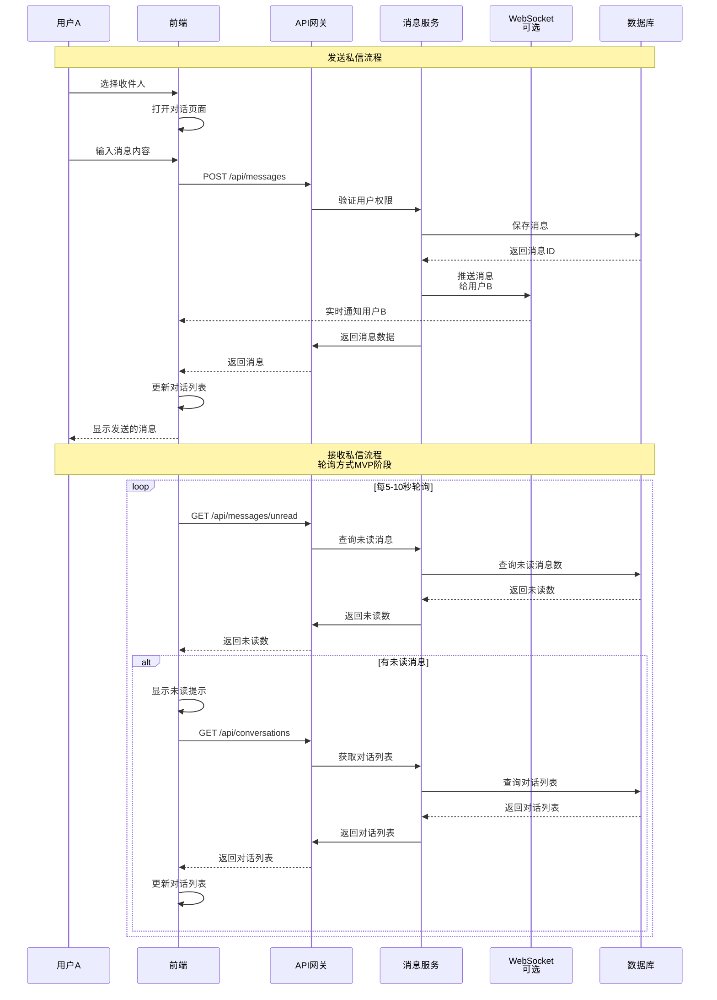

---

### 4.8 学习资料分享流程

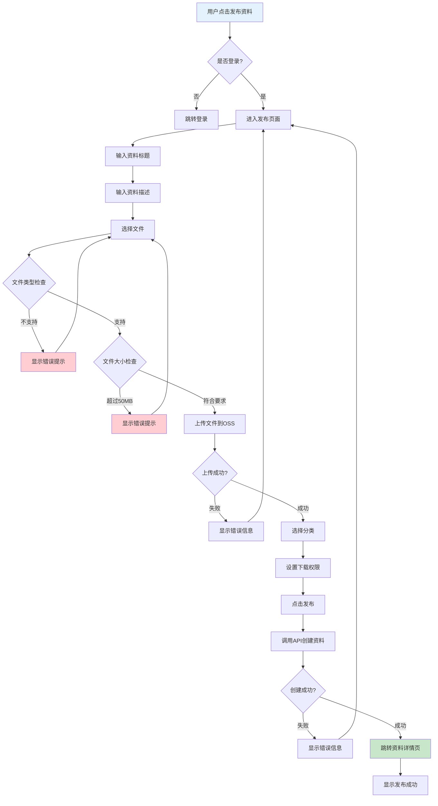

---

### 4.9 交易信息发布流程（通过普通发帖实现）

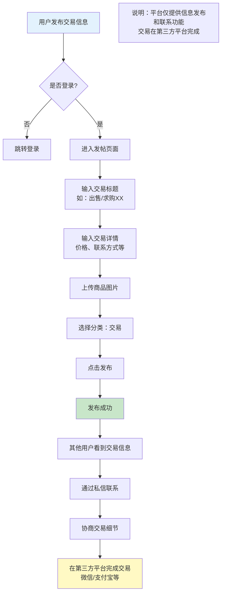

**流程说明：**
1. 用户通过普通发帖功能发布交易信息
2. 选择"交易"分类
3. 其他用户通过私信联系
4. 交易在微信、支付宝等第三方平台完成
5. 平台不涉及支付、订单管理等交易功能

---

## 五、数据流架构图

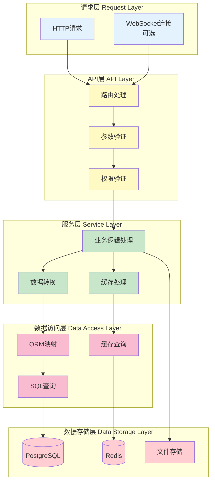

---

## 六、版本迭代架构

```mermaid
graph TB
    subgraph "v1.0 MVP版本"
        A1[用户系统]
        A2[发帖讨论]
        A3[分类管理]
        A4[基础搜索]
        A5[互动功能]
        A6[学习资料]
        A7[用户关注]
        A8[私信系统]
    end
    
    subgraph "v2.0 扩展版本"
        B1[活动组织]
        B2[通知优化]
        B3[搜索优化]
    end
    
    subgraph "v3.0 完善版本"
        C1[课程评价]
        C2[失物招领]
        C3[数据分析]
        C4[推荐系统]
    end
    
    Note: 交易信息通过"交易"分类发帖实现<br/>交易在第三方平台完成
    
    A2 --> B1
    A8 --> B2
    A4 --> B3
    
    B1 --> C1
    B1 --> C2
    B3 --> C3
    C3 --> C4
    
    style A1 fill:#4caf50
    style A2 fill:#4caf50
    style A3 fill:#4caf50
    style A4 fill:#4caf50
    style A5 fill:#4caf50
    style A6 fill:#4caf50
    style A7 fill:#4caf50
    style A8 fill:#4caf50
    style B1 fill:#2196f3
    style B2 fill:#2196f3
    style B3 fill:#2196f3
    style B4 fill:#2196f3
    style C1 fill:#ff9800
    style C2 fill:#ff9800
    style C3 fill:#ff9800
    style C4 fill:#ff9800
```

---

## 七、模块扩展机制

### 7.1 插件化架构

```mermaid
graph LR
    A[核心系统<br/>Core System] --> B[插件接口<br/>Plugin Interface]
    B --> C[功能插件1<br/>Event Plugin]
    B --> D[功能插件2<br/>Review Plugin]
    
    Note: 交易信息通过内容模块实现<br/>无需独立插件
    
    C --> E[独立数据库表]
    D --> E
    
    C --> F[独立API路由]
    D --> F
    
    style A fill:#4caf50
    style B fill:#2196f3
    style C fill:#ff9800
    style D fill:#ff9800
    style E fill:#ff9800
```

### 7.2 扩展点设计

**扩展点1：内容类型扩展**
- 基础：帖子（Post）
- 扩展：活动信息（Event）、课程评价（Review）
- **说明：** 交易信息通过普通帖子实现，选择"交易"分类即可，无需独立模块

**扩展点2：互动类型扩展**
- 基础：点赞、收藏、评论
- 扩展：分享、转发、打赏

**扩展点3：通知类型扩展**
- 基础：评论通知、点赞通知
- 扩展：活动通知、系统通知
- **说明：** 交易相关通知通过评论通知和私信通知实现

---

## 八、API设计架构

```mermaid
graph TB
    subgraph "API版本管理"
        A[v1.0 API]
        B[v2.0 API]
        C[v3.0 API]
    end
    
    subgraph "API模块"
        D[/api/auth<br/>认证模块]
        E[/api/users<br/>用户模块]
        F[/api/posts<br/>内容模块]
        G[/api/comments<br/>评论模块]
        H[/api/messages<br/>私信模块]
        I[/api/search<br/>搜索模块]
    end
    
    subgraph "扩展API模块"
        J[/api/events<br/>活动模块 v2.0]
        K[/api/reviews<br/>评价模块 v3.0]
    end
    
    Note: 交易信息通过/api/posts实现<br/>选择"交易"分类即可
    
    A --> D
    A --> E
    A --> F
    A --> G
    A --> H
    A --> I
    
    B --> J
    
    C --> K
    
    style A fill:#4caf50
    style B fill:#2196f3
    style C fill:#ff9800
```

---

## 九、数据库设计架构

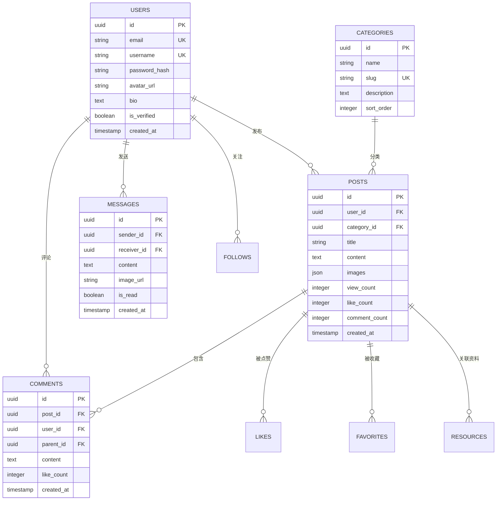

---

## 十、缓存策略架构

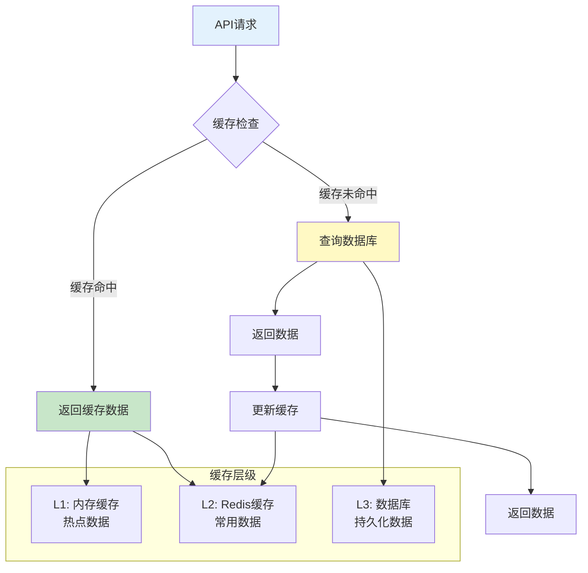

---

## 十一、错误处理流程

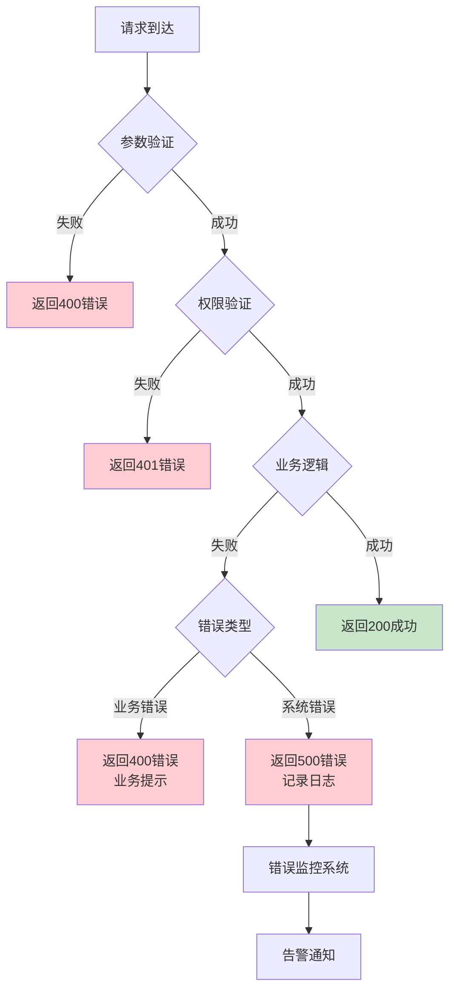

---

## 十二、性能优化架构

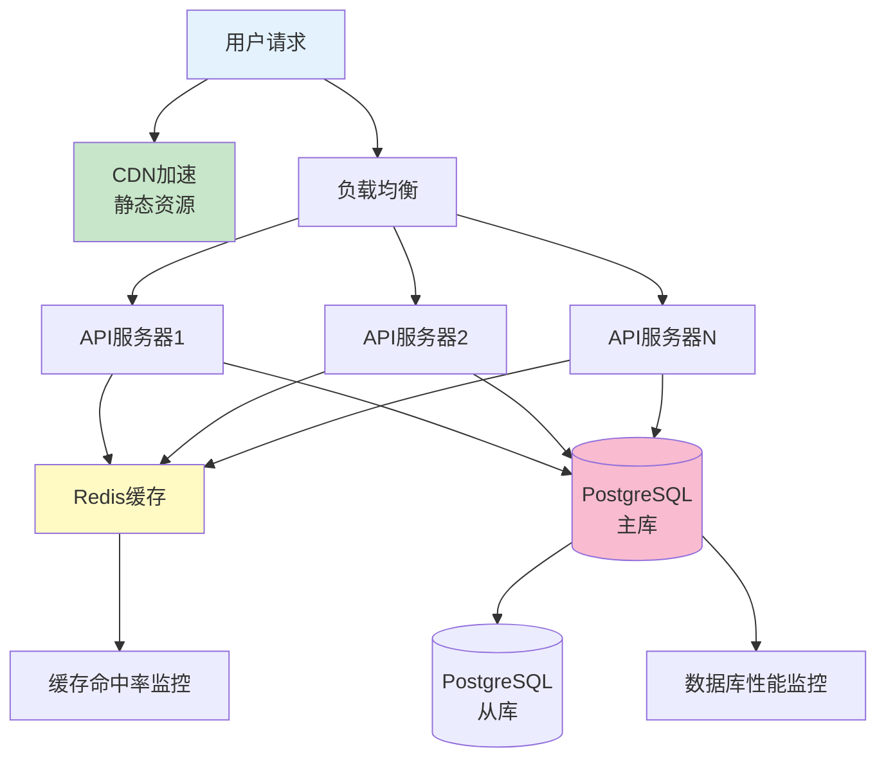

---

## 十三、安全架构

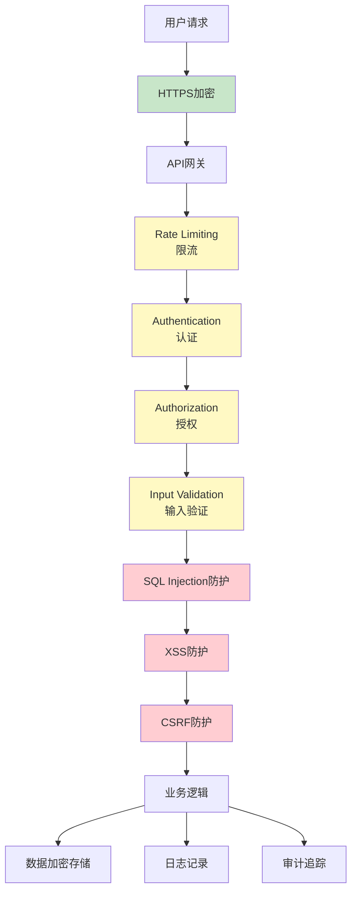

---

## 十四、监控与日志架构

```mermaid
graph TB
    A[应用服务] --> B[日志收集]
    B --> C[日志存储]
    C --> D[日志分析]
    
    A --> E[性能监控]
    E --> F[指标收集]
    F --> G[监控面板]
    
    A --> H[错误追踪]
    H --> I[错误告警]
    I --> J[通知系统]
    
    D --> K[数据分析]
    G --> K
    K --> L[优化建议]
    
    style A fill:#e3f2fd
    style C fill:#fff9c4
    style G fill:#c8e6c9
    style I fill:#ffcdd2
```

---

## 十五、部署架构

```mermaid
graph TB
    subgraph "开发环境 Dev"
        A1[本地开发]
        A2[开发服务器]
    end
    
    subgraph "测试环境 Test"
        B1[测试服务器]
        B2[测试数据库]
    end
    
    subgraph "生产环境 Prod"
        C1[生产服务器1]
        C2[生产服务器2]
        C3[生产数据库]
        C4[备份数据库]
    end
    
    A1 --> A2
    A2 --> B1
    B1 --> B2
    B1 --> C1
    B1 --> C2
    C1 --> C3
    C2 --> C3
    C3 --> C4
    
    style A1 fill:#e3f2fd
    style B1 fill:#fff9c4
    style C1 fill:#c8e6c9
    style C2 fill:#c8e6c9
```

---

## 十六、总结

### 16.1 架构特点

**1. 模块化设计**
- ✅ 功能模块独立
- ✅ 低耦合高内聚
- ✅ 便于维护和扩展

**2. 可扩展性**
- ✅ 插件化架构
- ✅ 版本化迭代
- ✅ 预留扩展接口

**3. 高性能**
- ✅ 多级缓存
- ✅ 数据库优化
- ✅ CDN加速

**4. 高可用**
- ✅ 负载均衡
- ✅ 主从复制
- ✅ 错误处理

**5. 安全性**
- ✅ 多层安全防护
- ✅ 数据加密
- ✅ 审计追踪

### 16.2 版本迭代策略

**v1.0 MVP版本：**
- 核心功能模块
- 基础架构
- 简单缓存

**v2.0 扩展版本：**
- 活动组织模块
- 通知优化
- 搜索优化
- 性能优化
- 缓存优化
- **说明：** 交易信息通过普通发帖实现，无需独立模块

**v3.0 完善版本：**
- 高级功能
- 数据分析
- 推荐系统

### 16.3 扩展机制

**功能扩展：**
- 通过插件接口添加新功能
- 不影响现有功能
- 独立数据库表设计
- **交易功能：** 通过内容模块的"交易"分类实现，无需独立模块

**性能扩展：**
- 水平扩展服务器
- 数据库读写分离
- 缓存集群

**功能迭代：**
- 版本化API
- 向后兼容
- 平滑升级

---

**文档版本：** v1.1  
**创建日期：** 2026-02-05  
**更新日期：** 2026-02-05  
**更新内容：** 移除二手交易模块，交易信息通过普通发帖实现  
**设计原则：** 现代、科学、高效、合理、可扩展  
**状态：** ✅ 已完成，可用于开发指导
